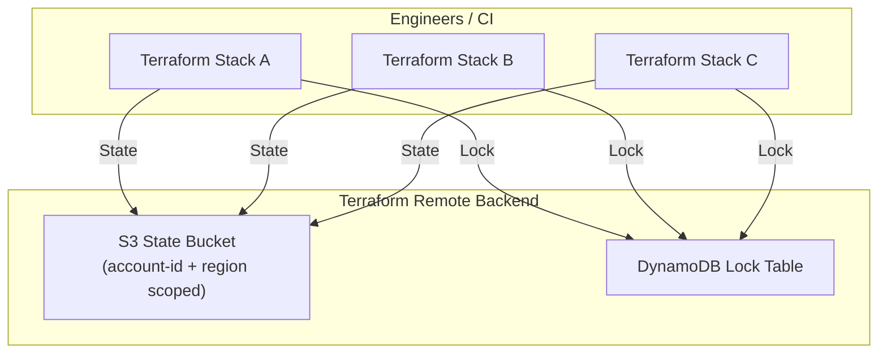

# Terraform Remote Backend Bootstrap (S3 + DynamoDB)

This module bootstraps a **secure, production‑ready Terraform remote backend** on AWS using:

* **S3** for Terraform state storage
* **DynamoDB** for state locking and concurrency control

It is designed to be run **once per AWS account / region**, and then reused by all other Terraform modules via an `s3` backend configuration.

---

## Architecture

This module implements a standard Terraform remote backend pattern
using Amazon S3 for state storage and DynamoDB for state locking.



## What This Module Creates

### AWS Resources

* **S3 bucket** (unique per account + region)

  * Versioning enabled
  * Server‑side encryption (AES‑256)
  * All public access blocked

* **DynamoDB table**

  * Used for Terraform state locking
  * PAY_PER_REQUEST billing mode

### Outputs

* S3 bucket name & ARN
* DynamoDB table name
* AWS account ID
* Example `backend "s3" {}` configuration
* Example `terraform init` command

---

## Why This Exists

Terraform remote state is **critical infrastructure**. This module ensures:

* Safe collaboration (state locking)
* State history (S3 versioning)
* Secure storage (encryption + public access block)
* Globally unique bucket names

This avoids common anti‑patterns such as:

* Local state files
* Manually created backend resources
* Inconsistent backend configuration across teams

---

## Requirements

* Terraform **>= 1.7.0**
* AWS Provider **~> 6.0**
* An AWS account with permissions to create:

  * S3 buckets
  * DynamoDB tables

---

## Provider Configuration

The AWS provider is configured using:

* `aws_region`
* `aws_profile`

```hcl
provider "aws" {
  region  = var.aws_region
  profile = var.aws_profile
}
```

This makes the module compatible with **local development**, **CI/CD**, and **multiple AWS profiles**.

---

## Naming Strategy

The S3 bucket name is automatically generated using:

```
<state_bucket_prefix>-<account-id>-<region>
```

Example:

```
terraform-state-123456789012-eu-west-2
```

This guarantees:

* Global S3 bucket uniqueness
* Safe reuse across accounts and regions

---

## Usage

### 1. Clone or reference the module

```bash
git clone <repo>
cd terraform-backend-bootstrap
```

### 2. Initialize Terraform

```bash
terraform init
```

### 3. Apply

```bash
terraform apply
```

After apply completes, **do not destroy this stack unless you intend to migrate state**.

---

## Using the Backend in Other Terraform Modules

Once this module is applied, use the generated backend configuration in all other Terraform projects.

### Example backend configuration

```hcl
terraform {
  backend "s3" {
    bucket         = "<generated-bucket-name>"
    key            = "path/to/state/terraform.tfstate"
    region         = "eu-west-2"
    dynamodb_table = "terraform-state-locks"
    encrypt        = true
  }
}
```

> **Important:**
>
> * The `key` **must be unique per module**
> * Never share the same state file between stacks

---

## Example `terraform init` (CLI)

```bash
terraform init \
  -backend-config="bucket=<generated-bucket-name>" \
  -backend-config="region=eu-west-2" \
  -backend-config="dynamodb_table=terraform-state-locks"
```

---

## Variables

| Variable              | Description                          | Default                 |
| --------------------- | ------------------------------------ | ----------------------- |
| `aws_region`          | AWS region                           | `eu-west-2`             |
| `aws_profile`         | AWS CLI profile                      | `default`               |
| `environment`         | Environment name                     | `lab`                   |
| `force_destroy`       | Force destroy S3 bucket with objects | `true`                  |
| `state_bucket_prefix` | S3 bucket prefix                     | `terraform-state`       |
| `dynamodb_table_name` | DynamoDB lock table name             | `terraform-state-locks` |

---

## Outputs

| Output                 | Description                      |
| ---------------------- | -------------------------------- |
| `s3_bucket_name`       | Terraform state bucket name      |
| `s3_bucket_arn`        | Terraform state bucket ARN       |
| `dynamodb_table_name`  | DynamoDB lock table              |
| `aws_region`           | Deployment region                |
| `account_id`           | AWS account ID                   |
| `backend_config`       | Copy‑paste backend configuration |
| `example_backend_init` | Example init command             |

---

## Best Practices

* Run this **once per account/region**
* Store this state separately from application stacks
* Restrict IAM access to the state bucket
* Never delete the DynamoDB lock table while state is in use
